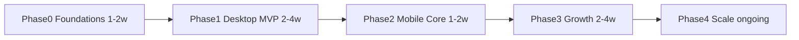
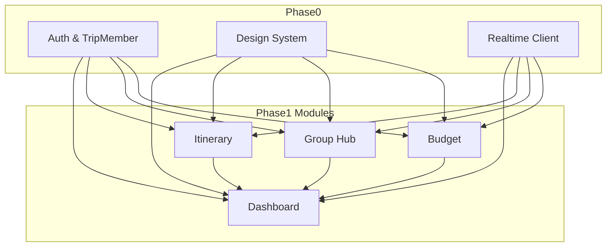
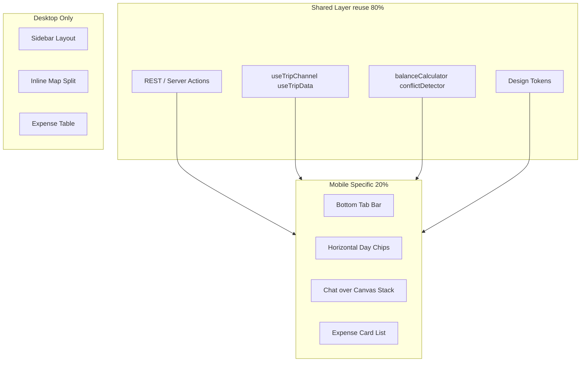
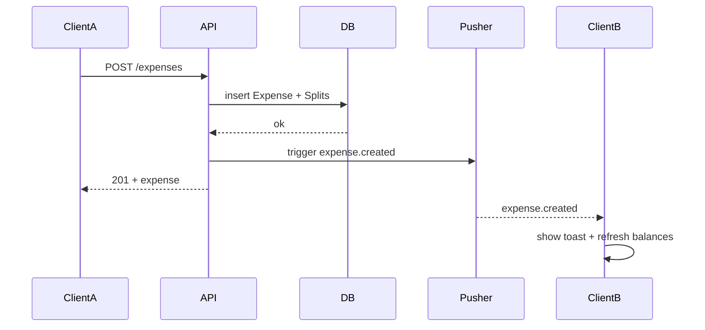

# TripSync — Implementation Plan

Companion to [`project-description.md`](project-description.md). This document turns the phased roadmap into actionable tasks, dependencies, acceptance criteria, and infrastructure decisions.

**Confirmed strategy**

| Decision | Choice |
|----------|--------|
| Phase 1 surface | Desktop-first full loop (4 modules) |
| Real-time | Managed service (Pusher recommended) |
| Stack | Next.js App Router + TypeScript + Prisma + PostgreSQL + Auth.js |

---

## Roadmap Overview



| Phase | Duration | Outcome |
|-------|----------|---------|
| 0 | 1–2 weeks | Runnable app skeleton, auth, schema, design system, realtime spike |
| 1 | 2–4 weeks | Desktop MVP shippable (Dashboard, Itinerary, Group Hub, Budget) |
| 2 | 1–2 weeks | Mobile core flows on shared APIs |
| 3 | 2–4 weeks | Growth features (advanced splits, Explore, notifications) |
| 4 | Ongoing | Observability, security, performance, cost control |

---

## Phase 0 — Foundations

**Goal:** Sustainable dev foundation; no feature-module rework later.

### 0.1 Project scaffold

| ID | Task | Owner | Depends on |
|----|------|-------|------------|
| P0-01 | Init Next.js 15 App Router + TypeScript + ESLint + Prettier (2-space indent, single quotes) | FE | — |
| P0-02 | Configure Tailwind with tokens from [`UI/DESIGN.md`](UI/DESIGN.md) | FE | P0-01 |
| P0-03 | Add shadcn/ui base + Material Symbols Outlined | FE | P0-02 |
| P0-04 | Folder layout per [`project-description.md` §9](project-description.md) | FE | P0-01 |
| P0-05 | Env template (`.env.example`): `DATABASE_URL`, `AUTH_SECRET`, `PUSHER_*`, `MAPBOX_TOKEN`, `R2_*` | BE | P0-01 |

### 0.2 Database & Prisma

| ID | Task | Owner | Depends on |
|----|------|-------|------------|
| P0-06 | `schema.prisma`: all entities from project description §5 | BE | P0-05 |
| P0-07 | Enums: `TripRole`, `ActivityType`, `SplitType`, `PinType`, `ExpenseCategory` | BE | P0-06 |
| P0-08 | Indexes: `TripMember(tripId,userId)`, `Activity(dayId,startTime)`, `Expense(tripId,createdAt)`, `ChatMessage(tripId,createdAt)` | BE | P0-06 |
| P0-09 | Initial migration + `prisma/seed.ts` (demo trip: Summer in Tokyo, 4 members) | BE | P0-08 |
| P0-10 | `lib/prisma.ts` singleton + health check route `GET /api/health` | BE | P0-09 |

### 0.3 Auth & authorization

| ID | Task | Owner | Depends on |
|----|------|-------|------------|
| P0-11 | Auth.js: email magic link + Google OAuth | BE | P0-10 |
| P0-12 | `User` sync on sign-in (create/update profile) | BE | P0-11 |
| P0-13 | `lib/auth/trip-access.ts`: `requireTripMember(tripId, minRole?)` guard | BE | P0-12 |
| P0-14 | Role matrix: owner (all), editor (CRUD except delete trip), viewer (read-only) | BE | P0-13 |

### 0.4 Trip lifecycle API

| ID | Task | Owner | Depends on |
|----|------|-------|------------|
| P0-15 | `POST /api/trips` — create trip (name, destination, dates, budgetLimit) | BE | P0-14 |
| P0-16 | `GET /api/trips`, `GET /api/trips/[id]` | BE | P0-15 |
| P0-17 | Invite flow: generate token link, `POST /api/trips/[id]/invites`, `POST /api/invites/[token]/accept` | BE | P0-15 |
| P0-18 | Trip layout shell: sidebar nav, trip context header (desktop) | FE | P0-04, P0-16 |

### 0.5 Design system components

| ID | Task | Owner | Depends on |
|----|------|-------|------------|
| P0-19 | `Button` (primary/secondary), `Input`, `Chip`, `Avatar`, `Card` | FE | P0-03 |
| P0-20 | `TripSidebar`, `TopAppBar`, presence avatar stack | FE | P0-19 |
| P0-21 | Empty / loading / error state components | FE | P0-19 |

### 0.6 Real-time spike

| ID | Task | Owner | Depends on |
|----|------|-------|------------|
| P0-22 | Pusher app + server auth endpoint `POST /api/realtime/auth` | BE | P0-13 |
| P0-23 | Client hook `useTripChannel(tripId)` + presence subscribe | FE | P0-22 |
| P0-24 | Demo page: join channel, broadcast ping, show online count | FE | P0-23 |

### Phase 0 acceptance criteria (Must Have)

- [ ] User can sign in and land on trip list or empty state.
- [ ] User can create a trip and see it in the list.
- [ ] Owner can copy invite link; second user accepts and appears as `TripMember`.
- [ ] `owner` / `editor` / `viewer` enforced on a protected API route (unit or integration test).
- [ ] `prisma migrate dev` and `prisma db seed` succeed on a clean database.
- [ ] Pusher presence shows 2+ users online on the demo channel.
- [ ] Design tokens render correctly on Button + Card (match Action Orange `#ab3600`).

### Phase 0 Nice to Have

- [ ] CI: lint + typecheck on PR.
- [ ] Staging deploy on Vercel + Neon branch DB.

---

## Phase 1 — Desktop MVP

**Goal:** Full desktop loop for one trip workspace; reference [`UI/desktop/`](UI/desktop/).

### Module dependency graph



---

### 1.1 Dashboard (`UI/desktop/trip_dashboard`)

**Route:** `/trips/[tripId]/dashboard`

| ID | Task | API / Data | Depends on |
|----|------|------------|------------|
| P1-D01 | Trip hero card (cover, destination tag, date range) | `Trip` fields | P0-18 |
| P1-D02 | Online Now pill (presence avatars + overflow) | Pusher presence | P0-24 |
| P1-D03 | Up Next list (next N activities by `startTime`) | `GET activities?upcoming=true` | P1-I05 |
| P1-D04 | Up Next row: icon, time, notes, type chip; click → itinerary | — | P1-D03 |
| P1-D05 | Collaboration cursor on hover (client-only mock → realtime later) | Optional `cursor.move` event | P1-D03 |
| P1-D06 | Quick Ideas panel | `CanvasPin` type=note OR dedicated `Idea` — reuse pins with `category=idea` | P1-G08 |
| P1-D07 | Idea row: category chip, vote count, comment count | `Vote` / `ChatMessage` link | P1-D06 |
| P1-D08 | Add idea button | `POST canvas-pins` | P1-D06 |
| P1-D09 | Group Budget mini-card (spent / limit, progress bar, %) | `GET budget/summary` | P1-B06 |
| P1-D10 | Open Full Itinerary CTA | Link to itinerary route | P1-I01 |

**Acceptance**

- [ ] Dashboard loads demo trip data matching prototype layout (8+4 column grid).
- [ ] Up Next reflects itinerary changes within 5s (realtime or revalidate).
- [ ] Budget bar updates when expense is added from Budget module.

---

### 1.2 Itinerary Planner (`UI/desktop/itinerary_planner`)

**Route:** `/trips/[tripId]/itinerary`

| ID | Task | API / Data | Depends on |
|----|------|------------|------------|
| P1-I01 | Split layout: timeline panel + map panel (`md:flex-row`) | — | P0-18 |
| P1-I02 | Day header: day number, date, label; sticky header | `ItineraryDay` | P1-I04 |
| P1-I03 | Day picker + filter buttons (UI; filter by `ActivityType`) | Query params | P1-I02 |
| P1-I04 | `CRUD /api/trips/[id]/days` | Prisma | P0-15 |
| P1-I05 | `CRUD /api/trips/[id]/activities` (dayId, type, title, startTime, duration, lat, lng, notes) | Prisma | P1-I04 |
| P1-I06 | Timeline card component (type chip, duration, overflow menu) | — | P0-19 |
| P1-I07 | Conflict detection service `detectConflicts(dayId)` | Server-side overlap on `startTime`+`duration` | P1-I05 |
| P1-I08 | Conflict UI: error border, badge, overlap message | Returns conflicting activity IDs | P1-I07 |
| P1-I09 | Add Activity dashed CTA + modal form | `POST activities` | P1-I05 |
| P1-I10 | Mapbox map: pins per activity, dashed route polyline | Mapbox GL JS | [Infra §6](#6-infrastructure-decisions) |
| P1-I11 | Map controls: zoom, recenter; stats overlay (distance, est. cost) | Mapbox Directions API (optional Phase 1) | P1-I10 |
| P1-I12 | Directions + Details buttons on lodging card | External maps link / detail drawer | P1-I06 |
| P1-I13 | Place search in top bar (Mapbox Geocoding) | Geocoding API | P1-I10 |
| P1-I14 | Realtime: `activity.created/updated/deleted` broadcast | Pusher | P0-22 |
| P1-I15 | Presence cursor on timeline item (simplified: editor avatar on card) | `presence` or `editor.focus` event | P1-I14 |

**Acceptance**

- [ ] CRUD activity updates timeline and map pins.
- [ ] Overlapping activities show conflict state (per prototype).
- [ ] Two browsers see activity updates without manual refresh.
- [ ] Map shows at least 3 pins + route for seed data.

---

### 1.3 Group Hub (`UI/desktop/group_hub`)

**Route:** `/trips/[tripId]/group-hub`

| ID | Task | API / Data | Depends on |
|----|------|------------|------------|
| P1-G01 | Split layout: chat pane (1/3) + canvas pane (2/3) | — | P0-18 |
| P1-G02 | `GET/POST /api/trips/[id]/messages` (pagination) | `ChatMessage` | P0-15 |
| P1-G03 | Chat UI: bubbles, avatars, timestamps, date divider | — | P1-G02 |
| P1-G04 | Chat input + attachment stub + send | `POST messages` | P1-G02 |
| P1-G05 | Realtime `message.created` | Pusher | P1-G02 |
| P1-G06 | Online count in chat header | Presence | P0-24 |
| P1-G07 | Chat search (filter client-side MVP) | — | P1-G03 |
| P1-G08 | `CRUD /api/trips/[id]/pins` (image/link/note) | `CanvasPin` + R2 upload for image | P0-15, Infra |
| P1-G09 | Canvas bento grid layout | — | P1-G08 |
| P1-G10 | Image pin: upload, category, favorite toggle | R2 presigned URL | P1-G08 |
| P1-G11 | Link pin: title, description, attribution | — | P1-G08 |
| P1-G12 | Note pin: sticky style, bullet list content (JSON) | — | P1-G08 |
| P1-G13 | `CRUD /api/trips/[id]/polls` + options | `Poll`, `PollOption` | P0-15 |
| P1-G14 | `POST polls/[id]/votes` (one vote per user per poll) | `Vote` unique constraint | P1-G13 |
| P1-G15 | Poll UI: progress bars, percentages, voter avatars, close date | — | P1-G14 |
| P1-G16 | System message when poll created | `ChatMessage` type=system OR client toast | P1-G13 |
| P1-G17 | Filter canvas by pin type/category | Query param | P1-G09 |
| P1-G18 | Live viewing indicator on pin | `pin.viewing` ephemeral event | P1-G05 |

**Acceptance**

- [ ] Messages appear in realtime for all trip members.
- [ ] Poll vote updates bars for all clients.
- [ ] Image pin uploads and renders on canvas.
- [ ] Quick Ideas on Dashboard can read from same pin/idea source.

---

### 1.4 Budget Tracker (`UI/desktop/budget_tracker`)

**Route:** `/trips/[tripId]/budget`

| ID | Task | API / Data | Depends on |
|----|------|------------|------------|
| P1-B01 | Page header: total trip cost | Sum of expenses | P1-B04 |
| P1-B02 | Add Expense CTA + modal form | — | P1-B04 |
| P1-B03 | Live toast: `expense.created` with dismiss | Pusher | P1-B04 |
| P1-B04 | `CRUD /api/trips/[id]/expenses` | `Expense` | P0-15 |
| P1-B05 | Split equally among all members on create | `ExpenseSplit` rows | P1-B04 |
| P1-B06 | `GET /api/trips/[id]/budget/summary` (total, limit, allocated %) | Trip.budgetLimit | P1-B04 |
| P1-B07 | Ledger table: Activity, Payer, Amount, Split, row menu | — | P1-B04 |
| P1-B08 | Balances widget: net per member (who owes whom) | `calculateBalances()` pure function | P1-B05 |
| P1-B09 | Settle Up flow (record settlement as adjustment expense or `Settlement` record) | `POST budget/settle` | P1-B08 |
| P1-B10 | Donut chart: Lodging / Transport / Food % | Group by `ExpenseCategory` | P1-B04 |
| P1-B11 | Live sync indicator on ledger header | — | P1-B03 |

**Acceptance**

- [ ] Adding expense updates balances for all members correctly (unit tests for `calculateBalances`).
- [ ] Equal split among 4 members matches prototype copy ("Equally (4)").
- [ ] Dashboard budget card stays in sync.
- [ ] Category chart matches ledger totals.

---

### Phase 1 integration milestones

| Milestone | Week target | Gate |
|-----------|-------------|------|
| M1.1 | End W1 | Trip shell + Itinerary CRUD + conflict detection |
| M1.2 | End W2 | Group Hub chat + Budget ledger |
| M1.3 | End W3 | Dashboard aggregation + realtime across modules |
| M1.4 | End W4 | E2E smoke pass + staging demo |

### Phase 1 Must Have (release gate)

- [ ] All four desktop routes functional against seeded trip.
- [ ] Role-based write blocked for `viewer`.
- [ ] Core E2E journey passes (see [§4.3](#43-e2e-scenarios)).
- [ ] No P0/P1 bugs open on staging.

---

## Phase 2 — Mobile Core

**Goal:** Mobile-critical paths using **shared APIs and components** from Phase 1; reference [`UI/mobile/`](UI/mobile/).

### Reuse strategy



| Layer | Reuse | Mobile-specific |
|-------|-------|-----------------|
| API routes | 100% | None |
| Business logic (`lib/`) | 100% | None |
| Realtime hooks | 100% | None |
| Layout | `TripTopBar` shared | `BottomTabNav` new |
| Dashboard | `BudgetSummary`, `UpNextCard` | Hero inline presence; upvote Ideas UI |
| Itinerary | `ActivityCard`, conflict logic | Day scroller; Map View full-screen route; mini-map in card |
| Group Hub | Chat components, pin API | Vertical split + grabber; inline poll card; horizontal pin scroll |
| Budget | `calculateBalances`, settle API | Settlement-first layout; recent expense cards; no donut chart |

### Phase 2 task list

| ID | Task | Priority | Depends on |
|----|------|----------|------------|
| P2-01 | `BottomTabNav` component (4 tabs, active pill) | P0 | P0-20 |
| P2-02 | Responsive layout wrapper: sidebar OR bottom nav by breakpoint | P0 | P2-01 |
| P2-03 | Mobile Dashboard (`trip_dashboard_mobile`) | P0 | P1-D*, P2-02 |
| P2-04 | Mobile Itinerary: day scroller + vertical timeline | P0 | P1-I*, P2-02 |
| P2-05 | Mobile Map View route `/itinerary/map` full-screen | P1 | P1-I10 |
| P2-06 | Mobile Group Hub: stacked chat + canvas | P0 | P1-G*, P2-02 |
| P2-07 | Mobile Budget: balances + recent expenses + settle | P0 | P1-B*, P2-02 |
| P2-08 | Touch targets ≥ 44px; bottom nav safe-area padding | P1 | P2-01 |
| P2-09 | FAB or header action for Add Expense on mobile | P1 | P1-B02 |

### Phase 2 scope boundaries (explicitly deferred)

- Draggable grabber resize persistence
- Full canvas bento grid on mobile
- Donut chart on mobile
- Explore / Community nav links
- Native push notifications

### Phase 2 acceptance criteria

- [ ] Mobile viewport (375px) completes: view next activity → open map → send chat → cast vote → view balance → settle.
- [ ] Bottom nav switches modules without full page reload (client navigation).
- [ ] Lighthouse mobile performance ≥ 80 on Dashboard (staging).

---

## Real-time, Testing & Release

### 4.1 Event model (Pusher)

**Channel naming**

| Channel | Type | Purpose |
|---------|------|---------|
| `private-trip-{tripId}` | Private | All trip events |
| `presence-trip-{tripId}` | Presence | Online members + optional `viewing` metadata |

**Event catalog**

| Event | Payload | Trigger | Consumers |
|-------|---------|---------|-----------|
| `message.created` | `{ messageId, tripId, userId, content, createdAt }` | After `POST messages` | Group Hub chat |
| `expense.created` | `{ expenseId, tripId, payerId, amount, title }` | After `POST expenses` | Budget toast, Dashboard summary |
| `expense.updated` | `{ expenseId, ... }` | After `PATCH expenses` | Budget ledger |
| `activity.created` | `{ activityId, dayId, ... }` | After `POST activities` | Itinerary, Dashboard Up Next |
| `activity.updated` | `{ activityId, ... }` | After `PATCH activities` | Itinerary, conflict recalc |
| `activity.deleted` | `{ activityId, dayId }` | After `DELETE activities` | Itinerary |
| `pin.created` | `{ pinId, type, ... }` | After `POST pins` | Canvas, Dashboard ideas |
| `poll.updated` | `{ pollId, optionId, voteCount }` | After vote | Group Hub poll UI |
| `editor.focus` | `{ userId, entityType, entityId }` | Client emit (throttled) | Itinerary card avatar |
| `cursor.move` | `{ userId, x, y, module }` | Client emit (throttled) | Dashboard hover (optional) |

**Client rules**

- Server authorizes channel subscription via `POST /api/realtime/auth` (checks `TripMember`).
- Server emits events **after** DB commit only.
- Client applies optimistic UI for own actions; reconciles on server event echo.
- Throttle `editor.focus` / `cursor.move` to 10 Hz max.



### 4.2 Testing layers

| Layer | Tool | Scope | Phase |
|-------|------|-------|-------|
| Unit | Vitest | `calculateBalances`, `detectConflicts`, role guards | 0–1 |
| Integration | Vitest + test DB | API routes + Prisma (trip invite, expense split) | 0–1 |
| Component | React Testing Library | Button, ActivityCard, ChatBubble | 1 |
| E2E | Playwright | Cross-module journeys (desktop) | 1 |
| E2E mobile | Playwright mobile viewport | Phase 2 critical path | 2 |
| Manual | Staging checklist | Realtime with 2 browsers | 1 |

**Coverage targets (Phase 1)**

- Unit: 90%+ on `lib/budget/*` and `lib/itinerary/conflicts.ts`
- Integration: all trip-scoped POST/PATCH/DELETE routes have happy-path + 403 test
- E2E: 4 scenarios (below) green on CI against staging

### 4.3 E2E scenarios

| ID | Journey | Steps |
|----|---------|-------|
| E2E-01 | Invite flow | User A creates trip → invites B → B accepts → both see trip |
| E2E-02 | Itinerary conflict | Add overlapping activities → conflict badge visible → fix time → badge gone |
| E2E-03 | Group decision | A posts message → B creates poll → A votes → bars update |
| E2E-04 | Budget split | A adds expense → B sees toast → balances show owes/gets back → settle |

### 4.4 Release gates

| Gate | Staging | Production |
|------|---------|------------|
| Migrations | `prisma migrate deploy` pass | Same + backup snapshot |
| Tests | Unit + integration required | E2E smoke required |
| Realtime | 2-user manual checklist | Monitor Pusher error rate |
| Rollback | Vercel instant rollback documented | Feature flags off for risky features |
| Observability | Logs visible in Vercel | Error alerting configured (Phase 4) |

**Feature flags (recommended)**

| Flag | Default | Module |
|------|---------|--------|
| `realtime_cursors` | off | Itinerary/Dashboard |
| `mapbox_directions` | off | Itinerary stats overlay |
| `custom_split` | off | Budget (Phase 3) |

---

## Infrastructure Decisions

Recommended defaults for Phase 0–1 (override before coding map/upload features).

| Area | Recommendation | Alternatives | Rationale | Phase needed |
|------|----------------|--------------|-----------|--------------|
| **Hosting** | Vercel | Railway, Fly | Native Next.js, preview deploys | 0 |
| **Database** | Neon PostgreSQL | Supabase, RDS | Serverless-friendly, branches for staging | 0 |
| **ORM** | Prisma | Drizzle | Workspace conventions, migrations | 0 |
| **Auth** | Auth.js v5 | Clerk | Fits full-stack Next, trip invite flow | 0 |
| **Realtime** | Pusher Channels | Ably, Supabase Realtime | User-confirmed managed choice; fast setup | 0 |
| **Maps** | Mapbox GL JS + Geocoding | Google Maps Platform | Strong custom map styling; fits Modern Explorer aesthetic | 1 (Itinerary) |
| **Object storage** | Cloudflare R2 + presigned URLs | S3, Uploadthing | Low cost, S3-compatible API; Uploadthing if speed > control | 1 (Group Hub images) |
| **Email** | Resend (invites) | SendGrid | Simple API for magic link + invite emails | 0–1 |
| **Charts** | Recharts or plain SVG | Chart.js | Donut chart in budget prototype is simple SVG-friendly | 1 |

### Environment variables (canonical)

```bash
# Database
DATABASE_URL=

# Auth.js
AUTH_SECRET=
AUTH_GOOGLE_ID=
AUTH_GOOGLE_SECRET=
AUTH_RESEND_KEY=

# Pusher
PUSHER_APP_ID=
PUSHER_KEY=
PUSHER_SECRET=
PUSHER_CLUSTER=

# Mapbox (Phase 1)
NEXT_PUBLIC_MAPBOX_TOKEN=
MAPBOX_SECRET_TOKEN=

# Cloudflare R2 (Phase 1)
R2_ACCOUNT_ID=
R2_ACCESS_KEY_ID=
R2_SECRET_ACCESS_KEY=
R2_BUCKET_NAME=
R2_PUBLIC_URL=

# App
NEXT_PUBLIC_APP_URL=
```

### Infra × milestone mapping

| Milestone | Infra required |
|-----------|----------------|
| P0 complete | Vercel, Neon, Auth.js, Pusher |
| P1 Itinerary | Mapbox token + billing account |
| P1 Group Hub | R2 bucket + CORS for uploads |
| P1 production | Custom domain, production Neon, R2 public URL |
| P2 | No new infra (reuse) |
| P3+ | Consider CDN cache rules, Pusher plan upgrade, email volume |

### Open items (confirm with stakeholder)

| Item | Impact if delayed |
|------|-------------------|
| Mapbox vs Google Maps | Blocks itinerary map (P1-I10) |
| R2 vs Uploadthing | Blocks image pins only; link/note pins unaffected |
| Team size / sprint length | Adjust week estimates in milestones |
| Production region (Neon) | Latency for target users |

---

## Phase 3 — Growth Features (outline)

| Epic | Features | Depends on |
|------|----------|------------|
| Budget advanced | Custom split, exclude member, bulk settle | P1-B* |
| Itinerary plus | Drag reorder, duplicate day, templates | P1-I* |
| Collaboration plus | Activity comment threads, full cursors | Realtime |
| Discovery | Explore / Community pages | New routes |
| Notifications | In-app + email for mentions, polls, expenses | Resend + prefs table |

---

## Phase 4 — Scale & Hardening (outline)

- Structured logging (request ID, tripId, userId).
- Metrics: API p95, Pusher delivery latency, DB connection pool.
- Rate limiting on auth and invite endpoints.
- Audit log for role changes and settlements.
- DB backup restore drill quarterly.
- Cost dashboard: Vercel, Neon, Pusher, Mapbox, R2.

---

## Suggested sprint backlog (first 2 sprints)

### Sprint 1 (Phase 0 + Itinerary start)

1. P0-01 → P0-18 (scaffold, schema, auth, trip CRUD, layout shell)
2. P0-22 → P0-24 (Pusher spike)
3. P1-I04 → P1-I09 (days + activities + conflict UI)

### Sprint 2 (Group + Budget + Dashboard)

1. P1-G02 → P1-G16 (chat + polls + pins)
2. P1-B04 → P1-B11 (expenses + balances + chart)
3. P1-D01 → P1-D10 (dashboard aggregation)
4. E2E-01 → E2E-04 (staging)

---

## Document links

| Doc | Purpose |
|-----|---------|
| [`project-description.md`](project-description.md) | Product features, data model, tech stack |
| [`implementation-plan.md`](implementation-plan.md) | This file — phased tasks and gates |
| [`UI/desktop/`](UI/desktop/) | Desktop visual reference |
| [`UI/mobile/`](UI/mobile/) | Mobile visual reference |

---

*Version 1.0 — implementation plan derived from TripSync phased roadmap.*
