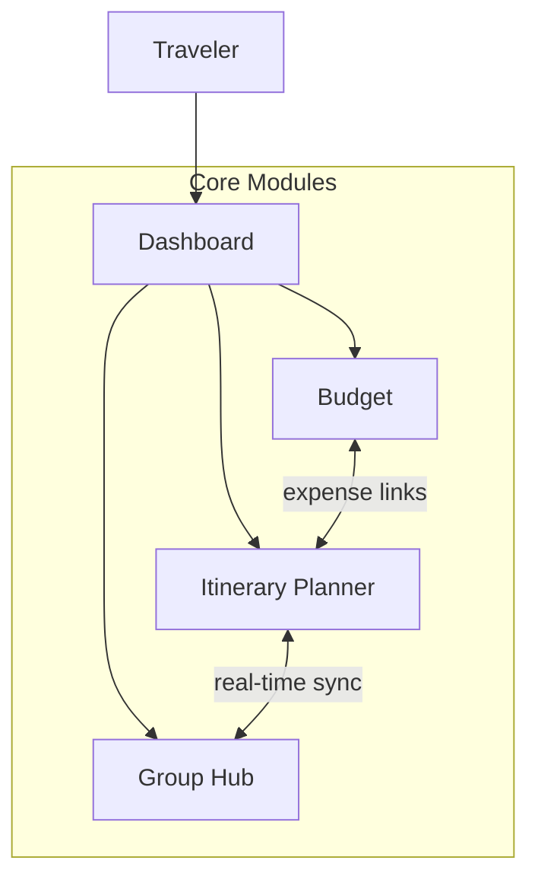
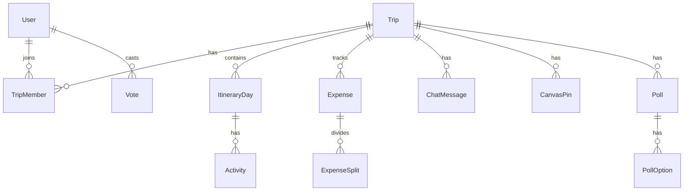
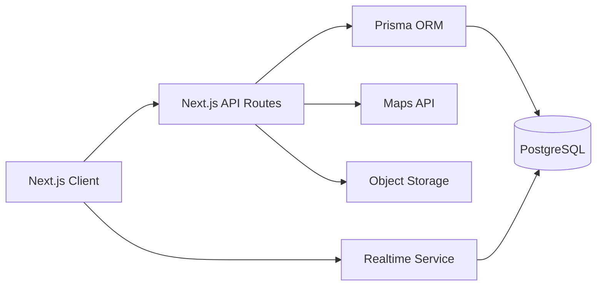

# TripSync — Project Description

## 1. Overview

**TripSync** is a collaborative trip planning platform for group travelers. It brings itinerary planning, group discussion, idea voting, and expense splitting into a single **Trip Workspace**, so friends and families can plan together without juggling group chats, spreadsheets, and map apps.

### Problem Statement

Group travel planning is fragmented:

- Itinerary details live in messages, notes, or spreadsheets that quickly go out of date.
- Decisions (where to eat, day trips, activities) get lost in chat threads.
- Expenses are tracked separately, making "who owes whom" awkward to settle.
- There is no shared view of what is happening next or who is currently editing the plan.

### Solution

TripSync provides one workspace per trip (e.g. *Summer in Tokyo* with 4 collaborators) with four integrated modules:

| Module | Purpose |
|--------|---------|
| **Dashboard** | Trip overview, upcoming activities, quick ideas, budget snapshot |
| **Itinerary Planner** | Day-by-day timeline with map, conflict detection, real-time editing |
| **Group Hub** | Squad chat, collaboration canvas, polls, mood board pins |
| **Budget** | Shared expense ledger, splits, balances, category breakdown |

### Target Users

- **Primary:** Groups of 2–8 travelers (friends, families, small teams)
- **Use case:** Pre-trip planning and in-trip coordination where fast, shared decisions matter

### Design Principles

- **Clarity for decisions** — High-contrast typography and structured cards for quick scanning
- **Real-time collaboration** — Live presence, cursors, and sync across modules
- **Map-first visualization** — Geography and routes as the planning canvas
- **Mobile-first layouts** — Dedicated mobile prototypes with bottom tab navigation; desktop prototypes with fixed sidebar (see [`UI/mobile/`](UI/mobile/), [`UI/desktop/`](UI/desktop/))



---

## 2. Core Features

Features below are extracted from UI prototypes in [`UI/desktop/`](UI/desktop/) and [`UI/mobile/`](UI/mobile/). Each page documents **UI sections → included features**, plus **desktop vs mobile** differences where the prototypes diverge.

### Prototype Index

| Page | Desktop | Mobile |
|------|---------|--------|
| Trip Dashboard | [`trip_dashboard/code.html`](UI/desktop/trip_dashboard/code.html) | [`trip_dashboard_mobile/code.html`](UI/mobile/trip_dashboard_mobile/code.html) |
| Itinerary Planner | [`itinerary_planner/code.html`](UI/desktop/itinerary_planner/code.html) | [`itinerary_planner_mobile/code.html`](UI/mobile/itinerary_planner_mobile/code.html) |
| Group Hub | [`group_hub/code.html`](UI/desktop/group_hub/code.html) | [`group_hub_mobile/code.html`](UI/mobile/group_hub_mobile/code.html) |
| Budget Tracker | [`budget_tracker/code.html`](UI/desktop/budget_tracker/code.html) | [`budget_tracker_mobile/code.html`](UI/mobile/budget_tracker_mobile/code.html) |

**Shared navigation pattern**

| Viewport | Primary nav | Trip context |
|----------|-------------|--------------|
| Desktop | Fixed left sidebar — Dashboard, Itinerary, Budget, Group Hub | Trip name, collaborator count, live avatars, Invite Explorer, Settings, Support |
| Mobile | Fixed bottom tab bar — same four modules | Trip name in top bar; compact avatar + notifications |

---

### 2.1 Trip Dashboard

**Purpose:** At-a-glance trip home — what's next, budget health, and ideas needing group input.

#### Page sections & features

| UI Section | Features |
|------------|----------|
| **Page header** | Page title ("Dashboard"); trip subtitle ("Planning 'Summer in Tokyo'") — desktop only |
| **Online presence** | "Online Now" collaborator avatars with green status dots; overflow count (+2); live pulse indicator — desktop |
| **Trip hero card** | Full-width cover image with gradient overlay; destination tag (e.g. Japan); date range chip (e.g. Aug 12–24); trip title on hero |
| **Up Next** | Next 1–2 scheduled activities with icon, time, title, notes, type chip (FLIGHT, etc.); hover shows collaborator cursor (desktop); link to full itinerary |
| **Quick Ideas** | Idea list with category tags; social signals (votes, comments); add new idea |
| **Group Budget** | Spent vs limit (e.g. $4,250 / $5k); progress bar; allocation percentage |

#### Desktop-specific ([`trip_dashboard`](UI/desktop/trip_dashboard/code.html))

- Two-column layout: hero + Up Next (8 cols) | Quick Ideas + Budget summary (4 cols)
- Up Next shows multiple items in a scrollable list inside the hero card
- Quick Ideas: checkbox-style items, thumb_up vote count, chat_bubble comment count
- Side nav includes Invite Explorer, Settings, Support
- Mobile-only top bar (TripSync logo) when viewport is narrow

#### Mobile-specific ([`trip_dashboard_mobile`](UI/mobile/trip_dashboard_mobile/code.html))

- Stacked single-column layout; hero includes inline **"2 online"** badge on cover
- **Up Next** as a dedicated card: time badge (14:30 JST), meeting point text, attendee avatars, **View Details** + **Directions** actions
- **Group Budget** card adds **Remaining: $750** and **4 Days Left**
- **Quick Ideas** redesigned for voting: thumbnail images, category + price tags ($$$, Free), **upvote** buttons with counts, **"Needs Votes"** status badge, **Add Idea** CTA
- Top bar: user avatar + trip name + notifications (no TripSync wordmark)

---

### 2.2 Itinerary Planner

**Purpose:** Build and review the day-by-day schedule; surface time conflicts; visualize locations on a map.

#### Page sections & features

| UI Section | Features |
|------------|----------|
| **Trip context (sidebar)** | Trip name, collaborator count, live presence avatars with online dots, Invite Explorer — desktop |
| **Day navigation** | Current day label + date subtitle (e.g. Day 1 — Tuesday, June 12 • Arrival); switch between days |
| **Activity timeline** | Vertical timeline with time column; activity cards with type chips (Flight, Transport, Lodging / Accommodation); title, notes, duration |
| **Activity actions** | Per-item overflow menu (desktop); Directions + Details buttons; Navigate from embedded map |
| **Time conflict alerts** | Error styling on conflicting items; "Time Conflict" / "Conflict" badge; overlap explanation (e.g. overlaps with Hotel Check-in); suggested remediation |
| **Real-time collaboration** | Named editor cursors on timeline items; "currently editing" pulse on active card; collaborator avatar on card; "X is tracking this" — mobile |
| **Add activity** | Dashed "Add Activity" button at timeline bottom — desktop |
| **Interactive map** | Location pins (airport, hotel, conflict point); dashed route line; pin labels on hover; zoom +/- and recenter; trip stats overlay (Total Distance, Est. Cost) — desktop |
| **Place search** | "Search places..." in top bar — desktop |
| **Day tools** | Calendar picker and filter buttons in timeline header — desktop |

#### Desktop-specific ([`itinerary_planner`](UI/desktop/itinerary_planner/code.html))

- **Split layout:** scrollable timeline (left ~1/3) + full interactive map (right)
- Map shows collaborator cursor on active pin; conflict pin uses error color + pulse
- Activity card states: default, conflict (error-container), active (primary left border + elevated shadow)
- Top bar: TripSync logo, Explore / Community links (**Phase 2**), search, notification dot, profile

#### Mobile-specific ([`itinerary_planner_mobile`](UI/mobile/itinerary_planner_mobile/code.html))

- **No side-by-side map** — full-width vertical timeline; **Map View** button opens map (implied full-screen)
- **Horizontal day selector:** snap-scroll chips (Day 1 / Oct 12 active, Day 2, Day 3…)
- Day theme title (e.g. "Tokyo Arrival") below selector
- Conflict card includes contextual warning text + **View Alternatives** CTA
- Lodging card embeds **mini map snippet** with **Navigate** button
- Simpler top bar: avatar, centered trip name, notifications only

---

### 2.3 Group Hub

**Purpose:** Squad communication and shared planning canvas — chat, polls, and mood-board pins in one place.

#### Page sections & features

| UI Section | Features |
|------------|----------|
| **Squad Chat** | Message thread with avatars, sender name, timestamp; sent vs received bubble styles; date divider ("Today") |
| **Chat header** | "Squad Chat" title; online count (e.g. "3 online now"); message search — desktop |
| **Chat input** | Text input with placeholder; attachment button (add_circle); send button |
| **System events** | Inline notices when user creates a poll (e.g. "You created a new poll") — desktop |
| **Collaboration Canvas** | Shared board for pins and polls; Filter + Add Pin actions — desktop |
| **Polls** | Multi-option vote with progress bars, percentages, voter avatars; close deadline; vote progress (e.g. 3/4 Voted); polls can appear on canvas or embedded in chat — mobile |
| **Canvas pins — Image** | Photo card with category tag, title, favorite button, live "X is viewing" indicator |
| **Canvas pins — Link** | Resource card with icon, title, description preview, contributor attribution, overflow menu |
| **Canvas pins — Note** | Sticky-note style list (e.g. Souvenir List with bullet items) |
| **Add content** | Add Pin (desktop canvas); Add Item dashed card (mobile canvas strip) |

#### Desktop-specific ([`group_hub`](UI/desktop/group_hub/code.html))

- **Split layout:** chat pane (~1/3 width, left) + Collaboration Canvas (right, bento grid)
- Canvas header: title, subtitle ("Drop ideas, vote on activities, and plan together"), Filter + Add Pin
- Poll spans 2 columns as priority item; photo / link / note pins in grid
- Sidebar: live presence rings on collaborator avatars, Invite Explorer

#### Mobile-specific ([`group_hub_mobile`](UI/mobile/group_hub_mobile/code.html))

- **Vertical split:** Squad Chat (~top 2/3) + Collaboration Canvas (~bottom 1/3) separated by **draggable grabber**
- Chat shows compact collaborator avatars (+2 overflow) in section header
- **Poll rendered inside chat** as an interactive card ("Day Trip to Hakone") with tappable options and vote count
- Chat uses **textarea** input (multi-line) instead of single-line input
- Canvas: **horizontal scroll** of pin cards; **View All** link to full canvas; pins include link card (with live pulse) and note card (with pinner avatar)
- No Filter button on mobile canvas

---

### 2.4 Budget Tracker

**Purpose:** Track shared trip spending, split costs, and settle balances between members.

#### Page sections & features

| UI Section | Features |
|------------|----------|
| **Cost overview** | Total trip cost headline (e.g. $3,450.00) |
| **Add expense** | Primary CTA to log new spending — desktop |
| **Live activity** | Toast when collaborator adds expense (avatar, name, item, amount, dismiss); "Live sync active" indicator — desktop |
| **Expense ledger** | List/table of expenses: activity name, category icon, payer, amount, split method |
| **Split display** | Split type badge (e.g. "Equally (4)", "Split Equally") |
| **Row actions** | Overflow menu on expense rows — desktop |
| **Balances** | Per-member balance: who owes whom or "gets back"; positive/negative amount styling |
| **Settlement** | **Settle Up** action; pending settlement summary — mobile |
| **Category breakdown** | Donut chart with Lodging / Transport / Food percentages and legend — desktop |
| **Recent expenses** | Card list of latest items with payer and split info — mobile |

#### Desktop-specific ([`budget_tracker`](UI/desktop/budget_tracker/code.html))

- **Shared Expenses** data table with sticky header columns: Activity, Payer, Amount, Split
- Live notification banner above table (e.g. "Sarah added Dinner at Sushi Dai • $145.00")
- Right sidebar widgets: **Balances** card + **Spending by Category** donut ($3.4k center total)
- Trip thumbnail in sidebar; Invite Explorer in nav
- Top bar: Explore / Community (**Phase 2**)

#### Mobile-specific ([`budget_tracker_mobile`](UI/mobile/budget_tracker_mobile/code.html))

- Centered **Total Trip Cost** display (large typography)
- **Pending Settlement** card with net amount owed (e.g. -$120.50) + prominent Settle Up button
- **Balances** as a vertical list; current user marked "(You)" with ring highlight
- **Recent Expenses** as stacked cards (not table) with category icon, amount, payer, split badge; **View All** link
- No donut chart, no live sync toast, no Add Expense button in prototype (may use FAB or nav action in implementation)
- Category examples in cards: restaurant, train (Shinkansen Tickets)

---

### 2.5 Global / Cross-Module

Features present across multiple page prototypes:

| Feature | Where it appears | Notes |
|---------|------------------|-------|
| Trip workspace context | All pages | Active trip name (e.g. Summer in Tokyo), 4 collaborators |
| Module navigation | All pages | Dashboard · Itinerary · Budget · Group Hub |
| Notifications | All top bars | Bell icon; unread dot on some desktop pages |
| User profile | Desktop top bar / mobile leading avatar | Circular photo avatar |
| Invite Explorer | Desktop sidebar | Group Hub, Itinerary, Budget, Dashboard |
| Settings & Support | Desktop sidebar footer | Not shown on mobile prototypes |
| Explore / Community | Desktop top nav | Itinerary, Group Hub, Budget — **Phase 2** |
| Dark mode | All prototypes | `dark:` Tailwind classes throughout |
| Real-time presence | Dashboard, Itinerary, Group Hub, Budget | Online dots, live sync, editor cursors, viewing indicators |

#### Desktop vs mobile summary

| Capability | Desktop | Mobile |
|------------|---------|--------|
| Navigation | Left sidebar + top app bar | Bottom tab bar + compact top bar |
| Itinerary map | Inline split-pane map | Map View button + inline mini-map on cards |
| Group Hub layout | Chat + canvas side-by-side | Chat + canvas stacked with resize grabber |
| Budget ledger | Full table + charts | Cards + settlement-first layout |
| Quick Ideas | Checkbox list with votes/comments | Thumbnail cards with upvote UI |
| Add expense | Header button | Not in mobile prototype |

---

## 3. Design System

**Reference:** [`UI/DESIGN.md`](UI/DESIGN.md) (canonical) · [`UI/desktop/modern_explorer/DESIGN.md`](UI/desktop/modern_explorer/DESIGN.md) · [`UI/mobile/modern_explorer/DESIGN.md`](UI/mobile/modern_explorer/DESIGN.md)

### Brand: Modern Explorer

Built for the adventurous yet organized traveler. Balances high-energy **Action Orange** with a map-inspired, low-strain canvas for long planning sessions.

### Colors

| Role | Value | Usage |
|------|-------|-------|
| Primary (Action Orange) | `#ab3600` | CTAs, live collaboration moments |
| Secondary (Deep Slate) | `#515f74` | Headers, icons, structural text |
| Background (Map Tint) | `#fcf9f8` | Page canvas, off-white base |
| Collaboration accents | Cyan, Violet, Lime | User presence cursors and avatar rings only |

### Typography

- **Font family:** Inter across all levels
- **Headlines:** Bold/ExtraBold with slight negative letter-spacing
- **Body:** Standard tracking, generous line height for readability
- **Labels:** Uppercase metadata where appropriate

### Layout & Spacing

| Breakpoint | Grid | Gutters | Side margins |
|------------|------|---------|--------------|
| Desktop | 12 columns | 24px | 48px |
| Tablet | 8 columns | 16px | 32px |
| Mobile | 4 columns | 16px | 16px |

- 4px baseline spacing scale: 8, 16, 24, 40, 64

### Elevation

| Level | Usage |
|-------|-------|
| 0 — Flat | Background canvas, inactive map areas |
| 1 — Soft border | Sidebars, persistent nav (1px border, no shadow) |
| 2 — Floating | Itinerary cards, trip modules (subtle diffused shadow) |
| 3 — Interactive | Presence indicators, tooltips, dropdowns |

### Key Components

- **Primary Button** — Action Orange fill, white text, 8px radius
- **Secondary Button** — 2px charcoal outline, transparent background
- **Itinerary Card** — 24px radius, level-2 shadow, 4px left accent for active day
- **Chips** — Pill-shaped tags (Flight, Dinner, Hiking)
- **Presence** — Colored cursors with name tags; circular avatars with halo ring
- **Navigation Bar** — Frosted glass (`backdrop-blur`), subtle bottom border

### UI Implementation Reference

Existing prototypes use **Tailwind CSS** + **Material Symbols Outlined**. Production components should map `DESIGN.md` tokens into Tailwind theme extensions (as done in prototype `tailwind.config` blocks).

---

## 4. Tech Stack

Confirmed stack: **Next.js full-stack** with Prisma and PostgreSQL.

| Layer | Technology | Rationale |
|-------|------------|-----------|
| Framework | Next.js (App Router) + TypeScript | Aligns with Tailwind prototypes; unified routing, SSR, and API |
| UI | Tailwind CSS + shadcn/ui (or custom components from DESIGN.md tokens) | Direct migration of color/spacing tokens from [`UI/`](UI/) |
| Icons | Material Symbols Outlined | Matches prototype icon set |
| Database | PostgreSQL + Prisma | Relational model fits Trip/Member/Expense relations; workspace Prisma conventions |
| Auth | Auth.js (NextAuth) | Email or OAuth login; invite-link onboarding to trips |
| Real-time | Pusher / Ably / Socket.io (or Supabase Realtime) | Chat, presence, collaboration cursors, live expense sync |
| Maps | Mapbox GL JS or Google Maps Platform | Pins, routes, distance/cost estimates |
| File storage | S3 / Cloudflare R2 / Uploadthing | Mood board image pins |
| Deployment | Vercel + managed PostgreSQL | Standard Next.js hosting path |

---

## 5. Data Model

Simplified entity relationships to guide Prisma schema design:



### Entity Field Highlights

| Entity | Key fields |
|--------|------------|
| **User** | email, name, avatarUrl |
| **Trip** | name, destination, startDate, endDate, coverImage, budgetLimit |
| **TripMember** | userId, tripId, role (owner / editor / viewer) |
| **ItineraryDay** | tripId, dayNumber, date, label (e.g. "Arrival") |
| **Activity** | dayId, type (flight / transport / lodging / activity), title, startTime, duration, lat, lng, notes |
| **Expense** | tripId, amount, category, payerId, splitType, linkedActivityId (optional) |
| **ExpenseSplit** | expenseId, userId, amount |
| **ChatMessage** | tripId, userId, content, createdAt |
| **CanvasPin** | tripId, type (image / link / note), content, category, createdBy |
| **Poll** | tripId, question, closesAt, createdBy |
| **PollOption** | pollId, label |
| **Vote** | pollOptionId, userId |

---

## 6. Architecture Overview



### Collaboration Strategy

- **Optimistic UI** for edits (itinerary, expenses, pins) with server reconciliation
- **WebSocket broadcast** for presence, chat messages, expense notifications, and cursor positions
- **Conflict detection** runs server-side: validate activity time overlaps when saving itinerary items; surface alerts in the Itinerary Planner UI

### API Surface (high level)

| Domain | Examples |
|--------|----------|
| Trips | CRUD, invite members, member roles |
| Itinerary | Days, activities, conflict check |
| Budget | Expenses, splits, balance calculation, settle up |
| Group Hub | Messages, pins, polls, votes |
| Realtime | Presence channel per trip, event pub/sub |

---

## 7. MVP Scope vs Future

### Phase 1 — MVP (aligned with existing 8 UI prototypes — 4 desktop + 4 mobile)

- [ ] User registration / login (Auth.js)
- [ ] Create trip, set dates/destination/budget limit
- [ ] Invite collaborators via link or email
- [ ] **Dashboard** — trip card, up next, quick ideas, budget summary
- [ ] **Itinerary Planner** — day timeline CRUD, map pins, conflict warnings, add activity
- [ ] **Group Hub** — chat, canvas pins (image/link/note), polls with voting
- [ ] **Budget** — expense ledger, equal split, balances, category chart, settle up
- [ ] Basic real-time: online presence, chat delivery, expense live notifications
- [ ] Map display with pins and routes (semi-interactive acceptable for MVP)

### Phase 2 — Future (hinted in UI, not prototyped)

- Explore / Community discovery pages
- External booking integrations (flights, hotels)
- Push notifications (PWA)
- AI-assisted itinerary suggestions
- Advanced split types (custom amounts, exclude members)
- Full real-time collaborative cursors on itinerary map

---

## 8. Non-Functional Requirements

| Area | Requirement |
|------|-------------|
| **Responsive** | Dedicated mobile prototypes with bottom tab bar; desktop prototypes with fixed sidebar (see [`UI/mobile/`](UI/mobile/), [`UI/desktop/`](UI/desktop/)) |
| **Accessibility** | High-contrast typography; focus rings on inputs (Action Orange ring per design system) |
| **Performance** | Lazy-load map tiles and mood board images; paginate expense ledger |
| **Security** | Trip-scoped authorization; role-based access (owner / editor / viewer) |
| **Data integrity** | Expense balance calculations must be deterministic and auditable |

---

## 9. Suggested Project Structure

```
TripPlanner/
├── UI/                         # Design prototypes (reference only)
│   ├── DESIGN.md               # Canonical Modern Explorer tokens
│   ├── desktop/
│   │   ├── modern_explorer/
│   │   │   └── DESIGN.md
│   │   ├── trip_dashboard/
│   │   ├── itinerary_planner/
│   │   ├── group_hub/
│   │   └── budget_tracker/
│   └── mobile/
│       ├── modern_explorer/
│       │   └── DESIGN.md
│       ├── trip_dashboard_mobile/
│       ├── itinerary_planner_mobile/
│       ├── group_hub_mobile/
│       └── budget_tracker_mobile/
├── project-description.md      # This document
├── prisma/
│   └── schema.prisma
├── src/
│   ├── app/                    # Next.js App Router pages & API routes
│   │   ├── (auth)/
│   │   ├── trips/[tripId]/
│   │   │   ├── dashboard/
│   │   │   ├── itinerary/
│   │   │   ├── budget/
│   │   │   └── group-hub/
│   │   └── api/
│   ├── components/             # UI components (design system)
│   ├── lib/                    # Prisma client, auth, utils
│   └── server/                 # Server actions, realtime handlers
├── public/
└── package.json
```

---

## 10. References

### Design System

| Resource | Path |
|----------|------|
| Canonical tokens | [`UI/DESIGN.md`](UI/DESIGN.md) |
| Desktop design system | [`UI/desktop/modern_explorer/DESIGN.md`](UI/desktop/modern_explorer/DESIGN.md) |
| Mobile design system | [`UI/mobile/modern_explorer/DESIGN.md`](UI/mobile/modern_explorer/DESIGN.md) |

### Desktop Prototypes

| Screen | Path |
|--------|------|
| Trip Dashboard | [`UI/desktop/trip_dashboard/code.html`](UI/desktop/trip_dashboard/code.html) |
| Itinerary Planner | [`UI/desktop/itinerary_planner/code.html`](UI/desktop/itinerary_planner/code.html) |
| Group Hub | [`UI/desktop/group_hub/code.html`](UI/desktop/group_hub/code.html) |
| Budget Tracker | [`UI/desktop/budget_tracker/code.html`](UI/desktop/budget_tracker/code.html) |

### Mobile Prototypes

| Screen | Path |
|--------|------|
| Trip Dashboard | [`UI/mobile/trip_dashboard_mobile/code.html`](UI/mobile/trip_dashboard_mobile/code.html) |
| Itinerary Planner | [`UI/mobile/itinerary_planner_mobile/code.html`](UI/mobile/itinerary_planner_mobile/code.html) |
| Group Hub | [`UI/mobile/group_hub_mobile/code.html`](UI/mobile/group_hub_mobile/code.html) |
| Budget Tracker | [`UI/mobile/budget_tracker_mobile/code.html`](UI/mobile/budget_tracker_mobile/code.html) |

---

*Document version: 1.2 — Core Features refined from desktop and mobile UI prototype analysis.*
