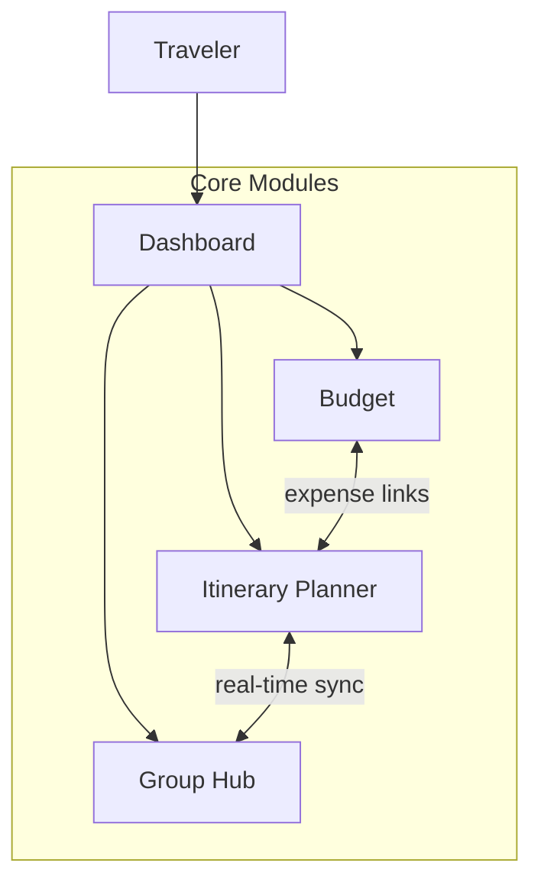
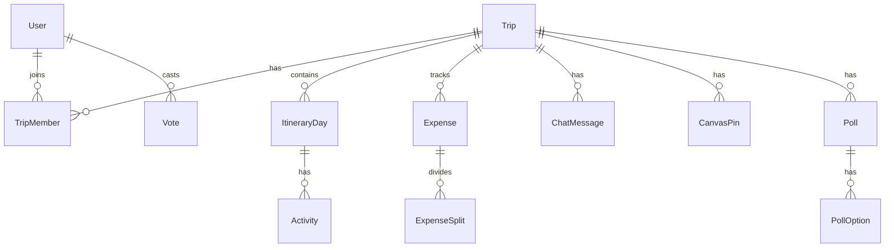
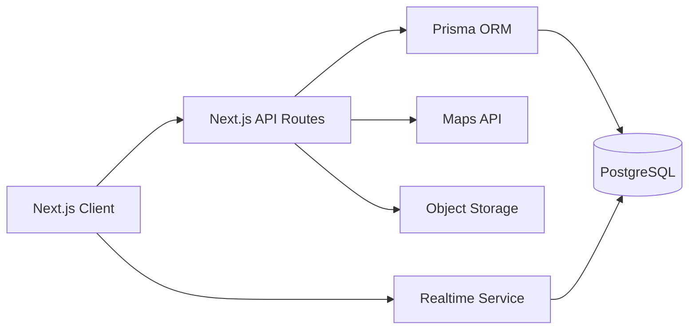

# TripSync — Project Description

## 1. Overview

**TripSync** is a collaborative trip planning platform for group travelers. It brings itinerary planning, group discussion, idea voting, and expense splitting into a single **Trip Workspace**, so friends and families can plan together without juggling group chats, spreadsheets, and map apps.

### Problem Statement

Group travel planning is fragmented:

- Itinerary details live in messages, notes, or spreadsheets that quickly go out of date.
- Decisions (where to eat, day trips, activities) get lost in chat threads.
- Expenses are tracked separately, making "who owes whom" awkward to settle.
- There is no shared view of what is happening next or who is currently editing the plan.

### Solution

TripSync provides one workspace per trip (e.g. *Summer in Tokyo* with 4 collaborators) with four integrated modules:

| Module | Purpose |
|--------|---------|
| **Dashboard** | Trip overview, upcoming activities, quick ideas, budget snapshot |
| **Itinerary Planner** | Day-by-day timeline with map, conflict detection, real-time editing |
| **Group Hub** | Squad chat, collaboration canvas, polls, mood board pins |
| **Budget** | Shared expense ledger, splits, balances, category breakdown |

### Target Users

- **Primary:** Groups of 2–8 travelers (friends, families, small teams)
- **Use case:** Pre-trip planning and in-trip coordination where fast, shared decisions matter

### Design Principles

- **Clarity for decisions** — High-contrast typography and structured cards for quick scanning
- **Real-time collaboration** — Live presence, cursors, and sync across modules
- **Map-first visualization** — Geography and routes as the planning canvas
- **Mobile-first layouts** — Dedicated mobile prototypes with bottom tab navigation; desktop prototypes with fixed sidebar (see [`UI/mobile/`](UI/mobile/), [`UI/desktop/`](UI/desktop/))



---

## 2. Core Features

Features below are derived directly from UI prototypes in [`UI/`](UI/). Prototypes are split by viewport:

| Viewport | Path | Screens |
|----------|------|---------|
| **Desktop** | [`UI/desktop/`](UI/desktop/) | `trip_dashboard`, `itinerary_planner`, `group_hub`, `budget_tracker` |
| **Mobile** | [`UI/mobile/`](UI/mobile/) | `trip_dashboard_mobile`, `itinerary_planner_mobile`, `group_hub_mobile`, `budget_tracker_mobile` |

Mobile layouts add a fixed **bottom tab bar** for primary navigation; desktop layouts use a persistent **left sidebar**. Feature parity is maintained across both sets unless noted.

### 2.1 Dashboard

**Reference:** [`UI/desktop/trip_dashboard/code.html`](UI/desktop/trip_dashboard/code.html) · [`UI/mobile/trip_dashboard_mobile/code.html`](UI/mobile/trip_dashboard_mobile/code.html)

| Feature | Description |
|---------|-------------|
| Trip hero card | Cover image, destination tag (e.g. Japan), date range (e.g. Aug 12–24) |
| Up Next preview | Next scheduled items (e.g. arrival at HND, hotel check-in) with type chips (FLIGHT, etc.) |
| Quick Ideas | Bucket-list items with category tags (DINING, SIGHTSEEING, ACTIVITY), vote counts, comment counts |
| Group Budget summary | Progress bar showing allocated vs. limit (e.g. $4,250 / $5k, 85%) |
| Online presence | "Online Now" collaborator avatars with live indicators |
| Invite Explorer | CTA to invite new trip members |
| Open Full Itinerary | Navigate to the full itinerary planner |

### 2.2 Itinerary Planner

**Reference:** [`UI/desktop/itinerary_planner/code.html`](UI/desktop/itinerary_planner/code.html) · [`UI/mobile/itinerary_planner_mobile/code.html`](UI/mobile/itinerary_planner_mobile/code.html)

| Feature | Description |
|---------|-------------|
| Split layout | Left: scrollable day timeline; Right: interactive map (desktop) |
| Day organization | Day header with date subtitle (e.g. Day 1 — Tuesday, June 12 • Arrival) |
| Activity cards | Time, title, notes, duration; type chips: Flight, Transport, Lodging |
| Time conflict detection | Visual alerts when activities overlap (e.g. train vs. hotel check-in) |
| Real-time collaboration | Live editor cursors, "currently editing" pulse indicators on cards and map |
| Add Activity | Dashed CTA to add new timeline entries |
| Map pins & routes | Location markers (airport, hotel, conflict points), dashed route lines |
| Trip stats overlay | Total distance and estimated cost (e.g. 42 km, ¥12,500) |
| Place search | "Search places..." in top bar |
| Calendar & filter | Day picker and activity filter controls |
| Directions | Per-activity navigation action |
| Map controls | Zoom in/out, recenter to my location |

### 2.3 Group Hub

**Reference:** [`UI/desktop/group_hub/code.html`](UI/desktop/group_hub/code.html) · [`UI/mobile/group_hub_mobile/code.html`](UI/mobile/group_hub_mobile/code.html)

| Feature | Description |
|---------|-------------|
| Squad Chat | Message thread with timestamps, avatars, send input |
| Online count | "3 online now" with pulse indicator |
| Collaboration Canvas | Bento-grid board for shared planning artifacts |
| Polls | Multi-option votes with percentages and voter avatars (e.g. "Day Trip to Hakone?") |
| Mood board pins | Image pins (e.g. restaurant alley photo), link pins (guides), sticky-note pins (lists) |
| Pin metadata | Category tags (Food & Drink), favorites, contributor attribution |
| Live viewing presence | "Mike is viewing" on canvas items |
| Add Pin / Filter | Create new pins; filter canvas content |
| Chat ↔ canvas linkage | System messages when polls are created from chat context |

### 2.4 Budget & Expenses

**Reference:** [`UI/desktop/budget_tracker/code.html`](UI/desktop/budget_tracker/code.html) · [`UI/mobile/budget_tracker_mobile/code.html`](UI/mobile/budget_tracker_mobile/code.html)

| Feature | Description |
|---------|-------------|
| Shared expense ledger | Table: Activity, Payer, Amount, Split method |
| Add Expense | Primary CTA to log new spending |
| Live sync notification | Toast when a collaborator adds an expense (e.g. "Sarah added Dinner at Sushi Dai • $145.00") |
| Split types | e.g. "Equally (4)" among trip members |
| Balances | Who owes whom summary (e.g. Mike owes Sarah $36.25) |
| Settle Up | Action to mark debts as settled |
| Spending by category | Donut chart: Lodging, Transport, Food with percentages |
| Total trip cost | Header summary (e.g. $3,450.00) |

### 2.5 Global / Cross-Module

| Feature | Description |
|---------|-------------|
| Desktop side navigation | Dashboard, Itinerary, Budget, Group Hub — fixed left sidebar |
| Mobile bottom tab bar | Same four modules via bottom nav (`md:hidden` in mobile prototypes) |
| Top app bar | Notifications, user profile avatar |
| Invite Explorer | Available from sidebar on every module |
| Settings & Support | Footer links in sidebar |
| Explore / Community | Present in top nav prototypes — **Phase 2** (not in MVP scope) |
| Dark mode | Supported in prototype styles (`dark:` Tailwind classes) |

---

## 3. Design System

**Reference:** [`UI/DESIGN.md`](UI/DESIGN.md) (canonical) · [`UI/desktop/modern_explorer/DESIGN.md`](UI/desktop/modern_explorer/DESIGN.md) · [`UI/mobile/modern_explorer/DESIGN.md`](UI/mobile/modern_explorer/DESIGN.md)

### Brand: Modern Explorer

Built for the adventurous yet organized traveler. Balances high-energy **Action Orange** with a map-inspired, low-strain canvas for long planning sessions.

### Colors

| Role | Value | Usage |
|------|-------|-------|
| Primary (Action Orange) | `#ab3600` | CTAs, live collaboration moments |
| Secondary (Deep Slate) | `#515f74` | Headers, icons, structural text |
| Background (Map Tint) | `#fcf9f8` | Page canvas, off-white base |
| Collaboration accents | Cyan, Violet, Lime | User presence cursors and avatar rings only |

### Typography

- **Font family:** Inter across all levels
- **Headlines:** Bold/ExtraBold with slight negative letter-spacing
- **Body:** Standard tracking, generous line height for readability
- **Labels:** Uppercase metadata where appropriate

### Layout & Spacing

| Breakpoint | Grid | Gutters | Side margins |
|------------|------|---------|--------------|
| Desktop | 12 columns | 24px | 48px |
| Tablet | 8 columns | 16px | 32px |
| Mobile | 4 columns | 16px | 16px |

- 4px baseline spacing scale: 8, 16, 24, 40, 64

### Elevation

| Level | Usage |
|-------|-------|
| 0 — Flat | Background canvas, inactive map areas |
| 1 — Soft border | Sidebars, persistent nav (1px border, no shadow) |
| 2 — Floating | Itinerary cards, trip modules (subtle diffused shadow) |
| 3 — Interactive | Presence indicators, tooltips, dropdowns |

### Key Components

- **Primary Button** — Action Orange fill, white text, 8px radius
- **Secondary Button** — 2px charcoal outline, transparent background
- **Itinerary Card** — 24px radius, level-2 shadow, 4px left accent for active day
- **Chips** — Pill-shaped tags (Flight, Dinner, Hiking)
- **Presence** — Colored cursors with name tags; circular avatars with halo ring
- **Navigation Bar** — Frosted glass (`backdrop-blur`), subtle bottom border

### UI Implementation Reference

Existing prototypes use **Tailwind CSS** + **Material Symbols Outlined**. Production components should map `DESIGN.md` tokens into Tailwind theme extensions (as done in prototype `tailwind.config` blocks).

---

## 4. Tech Stack

Confirmed stack: **Next.js full-stack** with Prisma and PostgreSQL.

| Layer | Technology | Rationale |
|-------|------------|-----------|
| Framework | Next.js (App Router) + TypeScript | Aligns with Tailwind prototypes; unified routing, SSR, and API |
| UI | Tailwind CSS + shadcn/ui (or custom components from DESIGN.md tokens) | Direct migration of color/spacing tokens from [`UI/`](UI/) |
| Icons | Material Symbols Outlined | Matches prototype icon set |
| Database | PostgreSQL + Prisma | Relational model fits Trip/Member/Expense relations; workspace Prisma conventions |
| Auth | Auth.js (NextAuth) | Email or OAuth login; invite-link onboarding to trips |
| Real-time | Pusher / Ably / Socket.io (or Supabase Realtime) | Chat, presence, collaboration cursors, live expense sync |
| Maps | Mapbox GL JS or Google Maps Platform | Pins, routes, distance/cost estimates |
| File storage | S3 / Cloudflare R2 / Uploadthing | Mood board image pins |
| Deployment | Vercel + managed PostgreSQL | Standard Next.js hosting path |

---

## 5. Data Model

Simplified entity relationships to guide Prisma schema design:



### Entity Field Highlights

| Entity | Key fields |
|--------|------------|
| **User** | email, name, avatarUrl |
| **Trip** | name, destination, startDate, endDate, coverImage, budgetLimit |
| **TripMember** | userId, tripId, role (owner / editor / viewer) |
| **ItineraryDay** | tripId, dayNumber, date, label (e.g. "Arrival") |
| **Activity** | dayId, type (flight / transport / lodging / activity), title, startTime, duration, lat, lng, notes |
| **Expense** | tripId, amount, category, payerId, splitType, linkedActivityId (optional) |
| **ExpenseSplit** | expenseId, userId, amount |
| **ChatMessage** | tripId, userId, content, createdAt |
| **CanvasPin** | tripId, type (image / link / note), content, category, createdBy |
| **Poll** | tripId, question, closesAt, createdBy |
| **PollOption** | pollId, label |
| **Vote** | pollOptionId, userId |

---

## 6. Architecture Overview



### Collaboration Strategy

- **Optimistic UI** for edits (itinerary, expenses, pins) with server reconciliation
- **WebSocket broadcast** for presence, chat messages, expense notifications, and cursor positions
- **Conflict detection** runs server-side: validate activity time overlaps when saving itinerary items; surface alerts in the Itinerary Planner UI

### API Surface (high level)

| Domain | Examples |
|--------|----------|
| Trips | CRUD, invite members, member roles |
| Itinerary | Days, activities, conflict check |
| Budget | Expenses, splits, balance calculation, settle up |
| Group Hub | Messages, pins, polls, votes |
| Realtime | Presence channel per trip, event pub/sub |

---

## 7. MVP Scope vs Future

### Phase 1 — MVP (aligned with existing 8 UI prototypes — 4 desktop + 4 mobile)

- [ ] User registration / login (Auth.js)
- [ ] Create trip, set dates/destination/budget limit
- [ ] Invite collaborators via link or email
- [ ] **Dashboard** — trip card, up next, quick ideas, budget summary
- [ ] **Itinerary Planner** — day timeline CRUD, map pins, conflict warnings, add activity
- [ ] **Group Hub** — chat, canvas pins (image/link/note), polls with voting
- [ ] **Budget** — expense ledger, equal split, balances, category chart, settle up
- [ ] Basic real-time: online presence, chat delivery, expense live notifications
- [ ] Map display with pins and routes (semi-interactive acceptable for MVP)

### Phase 2 — Future (hinted in UI, not prototyped)

- Explore / Community discovery pages
- External booking integrations (flights, hotels)
- Push notifications (PWA)
- AI-assisted itinerary suggestions
- Advanced split types (custom amounts, exclude members)
- Full real-time collaborative cursors on itinerary map

---

## 8. Non-Functional Requirements

| Area | Requirement |
|------|-------------|
| **Responsive** | Dedicated mobile prototypes with bottom tab bar; desktop prototypes with fixed sidebar (see [`UI/mobile/`](UI/mobile/), [`UI/desktop/`](UI/desktop/)) |
| **Accessibility** | High-contrast typography; focus rings on inputs (Action Orange ring per design system) |
| **Performance** | Lazy-load map tiles and mood board images; paginate expense ledger |
| **Security** | Trip-scoped authorization; role-based access (owner / editor / viewer) |
| **Data integrity** | Expense balance calculations must be deterministic and auditable |

---

## 9. Suggested Project Structure

```
TripPlanner/
├── UI/                         # Design prototypes (reference only)
│   ├── DESIGN.md               # Canonical Modern Explorer tokens
│   ├── desktop/
│   │   ├── modern_explorer/
│   │   │   └── DESIGN.md
│   │   ├── trip_dashboard/
│   │   ├── itinerary_planner/
│   │   ├── group_hub/
│   │   └── budget_tracker/
│   └── mobile/
│       ├── modern_explorer/
│       │   └── DESIGN.md
│       ├── trip_dashboard_mobile/
│       ├── itinerary_planner_mobile/
│       ├── group_hub_mobile/
│       └── budget_tracker_mobile/
├── project-description.md      # This document
├── prisma/
│   └── schema.prisma
├── src/
│   ├── app/                    # Next.js App Router pages & API routes
│   │   ├── (auth)/
│   │   ├── trips/[tripId]/
│   │   │   ├── dashboard/
│   │   │   ├── itinerary/
│   │   │   ├── budget/
│   │   │   └── group-hub/
│   │   └── api/
│   ├── components/             # UI components (design system)
│   ├── lib/                    # Prisma client, auth, utils
│   └── server/                 # Server actions, realtime handlers
├── public/
└── package.json
```

---

## 10. References

### Design System

| Resource | Path |
|----------|------|
| Canonical tokens | [`UI/DESIGN.md`](UI/DESIGN.md) |
| Desktop design system | [`UI/desktop/modern_explorer/DESIGN.md`](UI/desktop/modern_explorer/DESIGN.md) |
| Mobile design system | [`UI/mobile/modern_explorer/DESIGN.md`](UI/mobile/modern_explorer/DESIGN.md) |

### Desktop Prototypes

| Screen | Path |
|--------|------|
| Trip Dashboard | [`UI/desktop/trip_dashboard/code.html`](UI/desktop/trip_dashboard/code.html) |
| Itinerary Planner | [`UI/desktop/itinerary_planner/code.html`](UI/desktop/itinerary_planner/code.html) |
| Group Hub | [`UI/desktop/group_hub/code.html`](UI/desktop/group_hub/code.html) |
| Budget Tracker | [`UI/desktop/budget_tracker/code.html`](UI/desktop/budget_tracker/code.html) |

### Mobile Prototypes

| Screen | Path |
|--------|------|
| Trip Dashboard | [`UI/mobile/trip_dashboard_mobile/code.html`](UI/mobile/trip_dashboard_mobile/code.html) |
| Itinerary Planner | [`UI/mobile/itinerary_planner_mobile/code.html`](UI/mobile/itinerary_planner_mobile/code.html) |
| Group Hub | [`UI/mobile/group_hub_mobile/code.html`](UI/mobile/group_hub_mobile/code.html) |
| Budget Tracker | [`UI/mobile/budget_tracker_mobile/code.html`](UI/mobile/budget_tracker_mobile/code.html) |

---

*Document version: 1.1 — updated for `UI/desktop/` and `UI/mobile/` prototype layout.*
